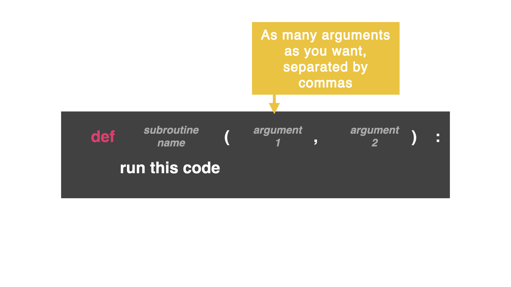

# Adding More Arguments

We can have as many arguments as we want, separated by commas. 




Now, this subroutine is expecting three arguments: ingredient, base, and coating:

```python
def whichCake(ingredient, base, coating)
```

👉 Let's update our code to now show all *three* arguments:

```python
def whichCake(ingredient, base, coating):
  if ingredient == "chocolate":
    print("Mmm, chocolate cake is amazing")
  elif ingredient == "broccoli":
    print("You what mate?!")
  else: 
    print("Yeah, that's great I suppose...")
  print("So you want a", ingredient, "cake on a", base, "base with", coating, "on top?")

whichCake("carrot", "biscuit", "icing")
```

👉 I could even ask the user to name an ingredient, base, and coating by adding:

```python
def whichCake(ingredient, base, coating):
  if ingredient == "chocolate":
    print("Mmm, chocolate cake is amazing")
  elif ingredient == "broccoli":
    print("You what mate?!")
  else: 
    print("Yeah, that's great I suppose...")
  print("So you want a", ingredient, "cake on a", base, "base with", coating, "on top?")

userIngredient = input("Name an ingredient: ")
userBase = input("Name a type of base: ")
userCoating = input("Fave cake topping: ")
whichCake(userIngredient, userBase, userCoating)
```

### What could you input to make a yummy cake?